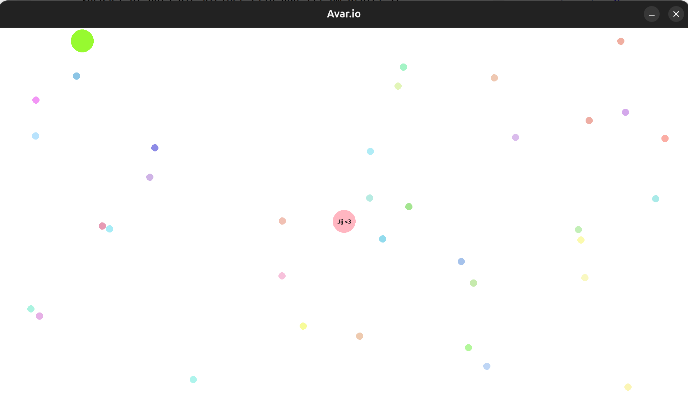

## Softeng-game-w6-7

# **Avar.io**

## **Introductie**

Wij hebben onze variant van het spel Agar.io gemaakt - Avar.io!
Je bestuurt je eigen bolletje over een kaart en eet voedsel of bots die kleiner zijn dan jij om groter te worden. 
Hoe groter je wordt, hoe trager je beweegt. 

## **Install/run instructies**

Zorg dat Python 3 geinstalleerd is. 

Installeer daarna de benodigde packages:

*pip install pygame*

start het spel:

*python main.py*

## **Spel instructies**

**Bewegen**: beweeg je muis op jouw bolletje te besturen

**Voedsel eten**: beweeg jouw bolletje over kleinere voedsel-bolletjes om groter te worden. Als jij groter bent dan een bot, minstens 10%, kan je hem ook opeten.

#### **Belangrijk om te weten:** 

Bots die groter zijn dan jij kunnen jou opeten! 
Hoe groter je wordt, hoe trager je beweegt.

## **Design**

Het spel is opgebouwd uit de volgende classes:

Entity: basis class voor bots en speler (polymorfisme)

Player: de speler

Bot: AI-bots die random over de kaart bewegen

Food: voedselbolletjes die ronddrijven in de wereld

Game: hoofd class die de game loop beheert

Camera: volgt de speler en past de weergave aan

#### *Auteurs*

Ariana Myasnykova

Viola Petrova
